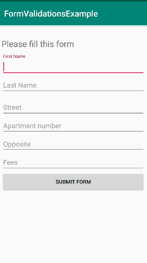

FormValidator
========
Easily Valdiate forms in android

Being an android developer you will come accoss forms where you need to make sure the user has filled all the fields. This gets very annoying if there are too many input fields as you need to check them each individually. Being an android developer i faced this issue so many times and no library came actually helped fixing this issue so i wrote one on my own.

This library allows you to validate huge forms containing various fields in android just by writing a single line, It saves you from the hassle of checking individual edit text boxes one by one then setting the error which puts a lot of bioler plate code.

This library supports edit texts view and no custom view is requred. The Libraray automatically detects TextInputLayouts ans sets errors on them if enabled. 

The library is written in kotlin and is build on top of RX Java and it provides methods for error handling as well. 

Example is mentioned in the project:

### How it works

    

Configuration
-------------

Add the dependency: 

    dependencies {
    	       //check the version from the badge above 
		 implementation 'com.oneclickaway.opensource.formvalidationsexample:validation:x.x.x'
	 }

In case you have optional parameters : 
        
 	val optionalInput = intArrayOf(R.id.optionalFirstET, R.id.optionalSecondET)
	FormValidator.isFormFilled( optionalParams = optionalInput, onResponseListener = this,
	viewGroup = mainLinearLayoutLL)
	
If you want to show errors: 
        
	FormValidator.isFormFilled( onResponseListener = this,  viewGroup = mainLinearLayoutLL, 
	errorEnabled = true)
	

You can show your custom error message: 
        
	FormValidator.isFormFilled( onResponseListener = this,  viewGroup = mainLinearLayoutLL, 
	errorEnabled = true, message="Field can't be left blank.")

#Example Kotlin Class: 

    import com.oneclickaway.opensource.validation.interfaces.OnResponseListener
    import com.oneclickaway.opensource.validation.model.FormValidator
    
    class MainActivity : AppCompatActivity(), OnResponseListener.OnFormValidationListener {

        val TAG = javaClass.simpleName

        lateinit var submitForm  : Button
        lateinit var mainLinearLayoutLL  : LinearLayout

        override fun onCreate(savedInstanceState: Bundle?) {
            super.onCreate(savedInstanceState)
            setContentView(R.layout.activity_main)

            submitForm = findViewById(R.id.submitFormBTN)
            mainLinearLayoutLL = findViewById(R.id.mainLinearLayoutLL)

            submitForm.setOnClickListener{
                FormValidator.isFormFilled(mainLinearLayoutLL, this, optionalParams = intArrayOf(R.id.lastNameET))
            }

        }

        override fun onFormValidationTaskSuccess(isFormFilled: Boolean) {
            /*Here isFormFilled represents that weather the form is filled or not*/

            if (isFormFilled){
                Toast.makeText(this, "Form filled", Toast.LENGTH_LONG).show()
            }else {
                Toast.makeText(this, "Form is not yet filled, Please fill the form.", Toast.LENGTH_LONG).show()
            }

        }

        override fun onFormValidationError(error: Throwable) {
            /*this method gives you a way of handling error if there is any*/
        }

        override fun onDestroy() {
            super.onDestroy()

            /*Be sure to call this in your onDestroy method to unBind the validator*/
            FormValidator.clearFormValidator()

        }

    }
   
Usage
-----
-Minimum sdk 15
-Validates form without the hasle of refering to each edit text and checking each input box.
-Can set errors if enabled
-Can skip optional values if you have any..

License
-----
	MIT License

	Copyright (c) 2019 Burhan ud din Drabu

	Permission is hereby granted, free of charge, to any person obtaining a copy
	of this software and associated documentation files (the "Software"), to deal
	in the Software without restriction, including without limitation the rights
	to use, copy, modify, merge, publish, distribute, sublicense, and/or sell
	copies of the Software, and to permit persons to whom the Software is
	furnished to do so, subject to the following conditions:

	The above copyright notice and this permission notice shall be included in all
	copies or substantial portions of the Software.

	THE SOFTWARE IS PROVIDED "AS IS", WITHOUT WARRANTY OF ANY KIND, EXPRESS OR
	IMPLIED, INCLUDING BUT NOT LIMITED TO THE WARRANTIES OF MERCHANTABILITY,
	FITNESS FOR A PARTICULAR PURPOSE AND NONINFRINGEMENT. IN NO EVENT SHALL THE
	AUTHORS OR COPYRIGHT HOLDERS BE LIABLE FOR ANY CLAIM, DAMAGES OR OTHER
	LIABILITY, WHETHER IN AN ACTION OF CONTRACT, TORT OR OTHERWISE, ARISING FROM,
	OUT OF OR IN CONNECTION WITH THE SOFTWARE OR THE USE OR OTHER DEALINGS IN THE
	SOFTWARE.
	
